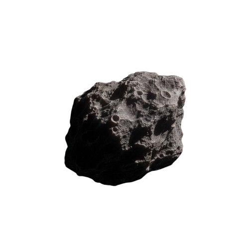

# Shahad Alrashoud
Developer interested in creative technology, and interactive web experiences.

## About Me
I enjoy building projects that combine design, storytelling, and code. My work includes hackathon projects, interactive web applications, and creative technical experiments.

## Featured Projects  

- **[PeopleLens: HR Analytics Platform](https://peoplelens-hr-dashboard.vercel.app/)**  
  SaaS-style HR analytics dashboard designed to visualize workforce insights, track employee performance, and support data-driven HR decisions through interactive dashboards, reports, and employee management features.

- **[BPrepared](https://bprepared.vercel.app/)**   
    An AI-powered interview coach that simulates real interviews, analyzes responses, and helps users become more confident candidates.
  
- **[Mithaqi: Family-Business Governance Platform](https://meethaqi.lovable.app/)**  
  Arabic digital platform developed to support governance practices in family businesses by organizing internal regulations, voting        processes, compliance monitoring, and stakeholder communication.

- **[Medsim: Intelligent Medical Simulation Platform](https://madsam.lovable.app/)**    
  LLM-powered educational web platform that helps health sciences students practice clinical reasoning through realistic virtual patient   simulations, history-taking, examination selection, and structured feedback.
  
- **[Remaining Fragments: Digital Identity Audit](https://shahadalrashoud.github.io/remaining-fragments/)**    
  Privacy-focused research prototype that demonstrates how usernames can leave recoverable traces across platforms, helping users understand digital exposure, data retention, and cross-platform identity risks.
  
- **[De-Orbit: Space Preservation Mission](https://shahadalrashoud.github.io/De-Orbit-Space-Preservation-Mission)**  
  De-Orbit: An immersive 3D space preservation mission built with Three.js. Track the real-time position of the ISS and clear orbital      debris to save the skies 
## Technical Skills

- Languages: JavaScript, TypeScript, HTML, CSS
- Frameworks/Libraries: React, Three.js
- Tools: Git, GitHub, VS Code

## Links
- LinkedIn: https://www.linkedin.com/in/shahad-alrashoud-25796b2b0
